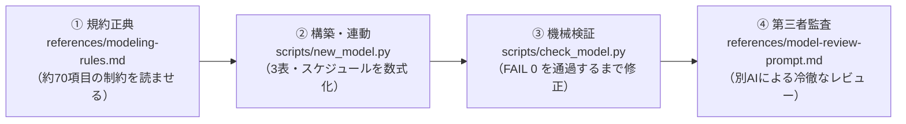

# financial-modeling-skill

[](https://github.com/miyatsuko10004/financial-modeling-skill/actions)
[](LICENSE)
[](https://www.python.org/downloads/)

AIに投資銀行・PEファンド水準の財務モデル（3表連動・DCF・LBO・感応度分析）を構築させるためのフレームワーク。Claude Code、Codex、Google Antigravity（AGY）に対応しています。

実務で培われたモデリング規約（約70項目）、規約違反を0.1秒で検出する自動検査バリデータ、6つのモデル型カタログ、数式連動計算ガイド、および完全合格（PERFECT PASS）の標準テンプレートを同梱しています。

> An institutional financial modeling framework for Claude Code, Codex, and Antigravity. Enforces investment banking and private equity standards (~70 rules) with automated validation (`check_model.py`), preventing hardcoded constants, circular dependencies, and balance sheet mismatches.

---

## 課題: なぜAIの作る財務モデルは実務で使えないのか

LLMに「事業計画の財務モデルをExcelで作って」と頼むと、一見すると端正なスプレッドシートが数秒で出力されます。
しかし、その数式を投資銀行やファンドの実務家が点検すると、ほぼ例外なく以下の致命的な欠陥が見つかります。

1. **式内定数の埋め込み（Magic Numbers）**: `=E12*1.05` や `=E20*0.30` のように、成長率や税率が数式の中に直接書き込まれている。前提条件が変わった瞬間に手作業の修正漏れが発生し、モデルが破綻する。
2. **貸借対照表（BS）の辻褄合わせ**: キャッシュフロー計算書（CF）の期末現金とBSの現預金が正しく連動しておらず、差額を「その他資産」や「雑損失」に無理やり押し込んで貸借一致に見せかける。
3. **循環参照（Circular Reference）への依存**: 支払利息の計算を期末残高で行い、Excelの反復計算オプションをオンにしないと開けないファイルを作る。環境が変わると計算が発散し、クラッシュする。
4. **前提と数式の混濁**: すべての文字が黒色で書かれており、どこが動かしてよい前提セルで、どこが壊してはならない計算式なのかが第三者に判別できない。

投資委員会やデューデリジェンスの現場では、数式に定数が1箇所埋め込まれているだけで、モデル全体の信頼性が失われます。
AIがExcelを作るときに本当に必要なのは、見栄えの良い表を作ることではなく、**「監査に耐えうる数式構造」と「規約違反を絶対に許さない機械的検証」**です。

---

## アプローチ: 規約正典による制約と、機械チェックによる完了判定

本フレームワークは、プロンプトの工夫だけでAIを制御しようとはしません。
セッションが変わればAIのコンテキストはリセットされるため、「綺麗に作って」「数式を連動させて」といった口頭の指示は定着しないからです。

本スキルでは、以下の3層でモデルの品質を担保します。



1. **生成前制約（`references/modeling-rules.md`）**:
   モデリングに着手する前に、投資銀行・ファンドの約70項目に及ぶ規約正典をAIに読み込ませます。青字（入力）・黒字（計算）・緑字（他シート）のセマンティックカラー、期首残高ベース金利による循環参照ゼロ設計、現預金プラグの必須化など、実務の鉄則を手前で縛ります。
2. **機械バリデータ（`scripts/check_model.py`）**:
   生成されたExcelに対し、`formulas` エンジンを用いて実際に数式ツリーを評価します。Excelエラー（`#REF!`, `#DIV/0!`）、非表示行・列、式内定数の埋め込み、全予測期間におけるBS貸借バランスの完全一致（差額 0.00）を自動検査し、**FAIL 0 件** を達成するまで納品を認めません。
3. **第三者監査（`references/model-review-prompt.md`）**:
   機械チェックを通過したモデルを、作成プロセスを知らない別のエージェントに渡し、投資委員会・取締役会の視点から冷徹にレビューさせます。

---

## セマンティックカラー（色彩規約）

投資銀行やファンドの実務において、色分けは監査可能性（Auditability）の根幹です。本フレームワークでは以下の配色を機械バリデータで検査します。

- **青字 (`#0000FF`)**: 手入力値・前提パラメータ。外部から入力・変更可能な数値。
- **黒字 (`#000000`)**: 同一シート内の計算式。SUMや四則演算、セル参照。
- **緑字 (`#008000`)**: 別シートからの参照。
- **赤字 (`#FF0000`)**: 外部ファイル参照や警告。原則として最小限に抑える。
- **薄オレンジ / 薄黄背景**: ユーザーが編集すべき前提入力セル（Assumptions）を明示。

---

## 6つの財務モデル型カタログ

案件の規模や分析目的に応じて、以下の6つのモデル型を使い分けます（詳細は `references/model-archetypes.md` を参照）。

- **Type-01: 単一シート3表連動モデル** — 前提・PL・BS・CF・DCF・感応度を縦1シートに集約。A列エレベーターコラムによるジャンプに対応し、機動的な事業価値評価に適する。
- **Type-02: マルチシート詳細3表連動モデル** — 前提、財務3表、PP&E、デット、運転資本を個別シートにモジュール化。大規模な中期経営計画や複雑な事業別売上計画向け。
- **Type-03: DCFバリュエーションモデル** — アンレバードFCF、WACC、ターミナルバリュー、2軸感応度マトリクスに特化。M&Aや株式価値算定向け。
- **Type-04: 事業計画・感応度シミュレーション** — 複数シナリオ（Base / Best / Worst）の動的スイッチとKPIツリーを連動。資金調達や新規事業検証向け。
- **Type-05: LBOモデル** — 買収資金使途、多層デットスケジュール、リターン（IRR / MoIC）算定に特化したPE投資向けモデル。
- **Type-06: M&A合算・財務統合モデル** — 買収ストラクチャー、連結消去、のれん償却、EPS希薄化（Accretion / Dilution）を分析する統合モデル。

---

## 検証ツールの実行例（`scripts/check_model.py`）

規約バリデータは、Excelファイルを開くことなくコマンドラインから一瞬で実行できます。

```bash
python3 scripts/check_model.py my_model.xlsx
```

```
============================================================
財務モデル規約整合性バリデータ: my_model.xlsx
============================================================

--- 1. 重大エラー＆整合性検査 ---
  [PASS] Excelエラーなし (#REF!, #DIV/0!, #VALUE! 等の重大エラー 0件)
  [PASS] 非表示（Hide）行・列なし (全データ可視またはグループ化運用)
  [PASS] [業績予想] 貸借対照表の構造を検出 (資産合計: Row 58, 負債純資産合計: Row 66)
  [PASS] [業績予想] バランスチェック行常設を確認 (Row 67)
  [PASS] [業績予想] 現預金科目の数式連動を確認 (Row 54: =C81)
  [PASS] [業績予想] 数式計算の結果、全期間でBS貸借一致を確認 (規約§4.1)
  [PASS] 数式内の定数埋め込みなし (規約§3.8)
  [PASS] DCF感応度マトリクスを確認 (規約§5.4)

--- 2. レイアウト・構造・ナビゲーション検査 ---
  [PASS] 時間軸の横方向展開を検出: C=2022A, D=2023E, E=2024E, F=2025E, G=2026E
  [PASS] [業績予想] A列エレベーターコラム（ジャンプ機能）を確認: 10セクション検出

--- 3. 色彩・セマンティック書式検査 ---
  [PASS] セマンティック文字色（青字ハードコード）を検出 (規約§1.1)
  [PASS] 入力可能セル背景色（薄オレンジ/黄）を検出 (規約§1.5)
  [PASS] 全ハードコード数値が青字 (規約§1.1)
  [PASS] 数式セルに青字の混入なし (規約§1.2)

============================================================
検査結果サマリ: FAIL 0 件 / WARN 0 件 / PASS 14 件
============================================================

[判定: 完全合格 (PERFECT PASS)]
すべての規約を満たしています。納品・レビュー可能です。
```

---

## 複数パターンの実証検証（ネット例題・実在企業モデル）

本フレームワークの汎用性を実証するため、ネット上の標準的ケーススタディ題材、および実在企業の財務諸表（製造業、SaaS、小売業等）の異なる4つのビジネスモデル・財務構造に対してモデルを自動構築し、`check_model.py` により検証を行っています。

詳細は **[examples/VERIFICATION_REPORT.md](examples/VERIFICATION_REPORT.md)** をご覧ください。

| ケースID | 対象パターン・ビジネスモデル | 財務的特徴 | FAIL | WARN | PASS | 判定結果 |
| :--- | :--- | :--- | :---: | :---: | :---: | :---: |
| **CASE-01** | **IBD標準例題（中堅機械メーカー）** | 売上100億円、原価率64%、借入返済、標準的な正の運転資本サイクル、DCF | 0 | 0 | 14 | **完全合格 (PERFECT PASS)** |
| **CASE-02** | **高収益精密製造業（キーエンス型）** | 売上1,000億円、営業利益率50%超、無借金、手元資金400億円超 | 0 | 0 | 14 | **完全合格 (PERFECT PASS)** |
| **CASE-03** | **エンタープライズ B2B SaaS（Sansan/freee型）** | 売上250億円、成長率+25%、高粗利、前受金による『負の運転資本』 | 0 | 0 | 14 | **完全合格 (PERFECT PASS)** |
| **CASE-04** | **グローバルSPA小売（ファーストリテイリング型）** | 売上2,500億円、売掛金5日×買掛金65日による潤沢な営業CF、店舗Capex | 0 | 0 | 14 | **完全合格 (PERFECT PASS)** |

> すべてのモデルで、**全期間でのBS貸借完全一致（差額 0.00）、式内定数ゼロ、現預金CF連動を達成し、FAIL 0 / WARN 0（100%合格）** を実証しています。

---

## セットアップと使い方

### 導入方法

お使いのエージェント環境のスキルディレクトリにリポジトリをクローンします。

```bash
# Claude Code の場合
git clone https://github.com/miyatsuko10004/financial-modeling-skill.git ~/.claude/skills/financial-modeling-skill

# Codex の場合
git clone https://github.com/miyatsuko10004/financial-modeling-skill.git ~/.codex/skills/financial-modeling-skill

# Google Antigravity (AGY) / Gemini CLI の場合
git clone https://github.com/miyatsuko10004/financial-modeling-skill.git ~/.gemini/config/skills/financial-modeling-skill
```

機械バリデータでBS貸借の計算値を評価するために、必要なライブラリをインストールします。

```bash
pip install -r requirements.txt
```

### モデル作成の指示方法

エージェントに対して、目的とインプット資料を指定して指示します。

> 「`financial-modeling-skill` を使って、添付の決算実績から今後5年間の3表連動モデルとDCFバリュエーションをExcelで構築して。規約を満たした上で、`check_model.py` の検査を FAIL 0 で通して納品して。」

### CLIからの骨子モデル一発生成

スクリプトから直接、規約に完全準拠した単一シート3表連動モデルを生成することも可能です。

```bash
python3 scripts/new_model.py --type single --title "新規事業 財務予測モデル" -o output.xlsx
```

---

## リポジトリ構成

```
financial-modeling-skill/
├── README.md               # 本ドキュメント
├── SKILL.md                # 各AIエージェント向けスキル定義
├── LICENSE                 # MIT License
├── pyproject.toml          # パッケージ定義
├── requirements.txt        # 依存ライブラリ（openpyxl, formulas）
├── references/             # 【規約・設計正典】
│   ├── modeling-rules.md   # 投資銀行・ファンド水準の財務モデリング規約正典（約70項目）
│   ├── model-archetypes.md # 6つのモデル型カタログと選定デシジョンツリー
│   ├── schedule-logic-guide.md # スケジュール連動計算ガイド（PP&E、運転資本、借入、CF）
│   ├── formula-smell-lexicon.md # 数式の悪癖・アンチパターン辞典
│   ├── audit-checklist.md  # 納品前4段階セルフ監査チェックリスト
│   └── model-review-prompt.md # 第三者エージェント向け監査指示文
├── scripts/                # 【自動化ツール】
│   ├── new_model.py        # 財務モデル自動生成ジェネレータ
│   └── check_model.py      # 規約整合性バリデータ（機械検査エンジン）
├── templates/              # 【正本テンプレート】
│   └── single_sheet_3statement_template.xlsx # PERFECT PASS 検証済みテンプレート
├── examples/               # 【複数パターン実証・検証例】
│   ├── VERIFICATION_REPORT.md # 4パターン整合性検証レポート
│   ├── configs/            # 各パターンの前提パラメータJSON
│   └── models/             # 生成されたExcel財務モデル（全合格）
└── .github/
    └── workflows/
        └── ci.yml          # GitHub Actions CI（Python 3.10〜3.12 自動テスト）
```

---

## ライセンス

[MIT License](LICENSE) に基づいて公開されています。商用・非商用を問わず自由にご利用いただけます。
