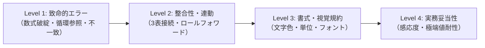

# 財務モデル納品前セルフ監査チェックリスト（audit-checklist.md）

財務モデルは、1箇所の数式ミスや符号違いが数億円〜数百億円の意思決定の狂いにつながる。
モデル作成者およびレビューエージェントは、成果物をクライアントや社内PMへ提出する前に、本チェックリストの全項目を点検しなければならない。

---

## 財務モデル監査ゲート（4段階チェック）



---

### Level 1: 致命的エラー・完全性チェック（Critical Gate - 違反時即却下）

| No | 監査項目 | 検証方法・基準 | 合格判定 |
| :---: | :--- | :--- | :---: |
| 1.1 | **バランスシートの貸借完全一致** | 予測全期間において `資産合計 − 負債純資産合計 ＝ 0.00` であること。 | [ ] PASS |
| 1.2 | **Excelエラーの完全撲滅** | `#REF!`, `#DIV/0!`, `#VALUE!`, `#N/A`, `#NAME?` がモデル内に1箇所も存在しないこと。 | [ ] PASS |
| 1.3 | **循環参照（Circular References）の根絶** | 開いた際に「循環参照に関する警告」が一切出ないこと。利息計算が期首残高ベースになっていること。 | [ ] PASS |
| 1.4 | **非表示（Hide）行・列の完全禁止** | 高さ0・幅0の非表示セルがないこと。折りたたみは「グループ化（Data Grouping）」のみを使用していること。 | [ ] PASS |

---

### Level 2: 3表連動・スケジュール整合性チェック（Integrity Gate）

| No | 監査項目 | 検証方法・基準 | 合格判定 |
| :---: | :--- | :--- | :---: |
| 2.1 | **現預金のダイレクト連動** | BSの「現預金」セルが、キャッシュフロー計算書の「期末現金残高」セルを直接参照していること。 | [ ] PASS |
| 2.2 | **有形固定資産のロールフォワード** | `期末PP&E ＝ 前期末PP&E ＋ Capex − 減価償却費` で計算され、Capexが投資CFに、減価償却がPLおよび営業CFに正しく連動していること。 | [ ] PASS |
| 2.3 | **利益剰余金のロールフォワード** | `期末利益剰余金 ＝ 前期末利益剰余金 ＋ 当期純利益 − 配当金` で計算され、当期純利益がPL最下行と完全一致していること。 | [ ] PASS |
| 2.4 | **Δ運転資本の符号正当性** | 運転資本増加（売掛金増・在庫増）の期に、CFの運転資本増減がマイナス（資金流出）として計算されていること。 | [ ] PASS |
| 2.5 | **借入金の返済・残高連動** | 借入金返済額が財務CFにマイナスで反映され、BSの固定負債/流動負債がスケジュール期末残高と一致していること。 | [ ] PASS |

---

### Level 3: 書式・視覚設計・規約準拠チェック（Presentation Gate）

| No | 監査項目 | 検証方法・基準 | 合格判定 |
| :---: | :--- | :--- | :---: |
| 3.1 | **青字・黒字の完全分離** | 実績値・前提数値の直接入力セルが**青字（#0000FF）**、計算式セルが**黒字（#000000）**になっていること。 | [ ] PASS |
| 3.2 | **外部シート参照の緑字化** | 多シートモデルにおいて別シートから参照しているセルが**緑字（#008000）**になっていること。 | [ ] PASS |
| 3.3 | **入力可能セルの明示（オレンジ背景）** | ユーザーが変更可能なパラメータ入力セルに薄いオレンジ/黄色背景が設定されていること。 | [ ] PASS |
| 3.4 | **エレベーターコラムの配備** | A列にセクション番号（`（１）前提`等）のみが配置され、途中の行が空白で `Ctrl+↓` ジャンプが可能になっていること。 | [ ] PASS |
| 3.5 | **時間軸の横方向統一** | 全シートで同じ列（例: C列＝直近実績、D列＝翌期予想…）に時間軸が統一され、ズレがないこと。 | [ ] PASS |
| 3.6 | **表示形式の統一と単位明記** | 各シート上部に「（単位：百万円）」等が明記され、金額はカンマ区切り（`#,##0`）、比率はパーセント（`0.0%`）で統一されていること。 | [ ] PASS |

---

### Level 4: ストレステスト・感応度チェック（Robustness Gate）

| No | 監査項目 | 検証方法・基準 | 合格判定 |
| :---: | :--- | :--- | :---: |
| 4.1 | **売上ゼロ/マイナス成長ストレステスト** | 売上成長率をマイナス（例: -30%）にした場合でも、数式がエラー（#DIV/0!）にならず、現預金減少と借入残高が正しく反映されること。 | [ ] PASS |
| 4.2 | **赤字時の税金・配当ガード** | 税引前利益が赤字の場合に税金が不当に巨額還付（マイナス税金）されないか、または赤字時に配当がゼロになるガードロジックが入っていること。 | [ ] PASS |
| 4.3 | **感応度テーブルの動作確認** | DCFモデル等の感応度マトリクス（WACC × 成長率）が、前提変更に追従して自動再計算されること。 | [ ] PASS |

---

## 機械チェックの実行手順

手動確認に先立ち、必ずリポジトリ内のバリデータスクリプトを実行してください：
```bash
python3 scripts/check_model.py path/to/your_model.xlsx
```
**出力結果の `FAIL 0` を確認したのち、PMレビューまたは納品を行ってください。**
