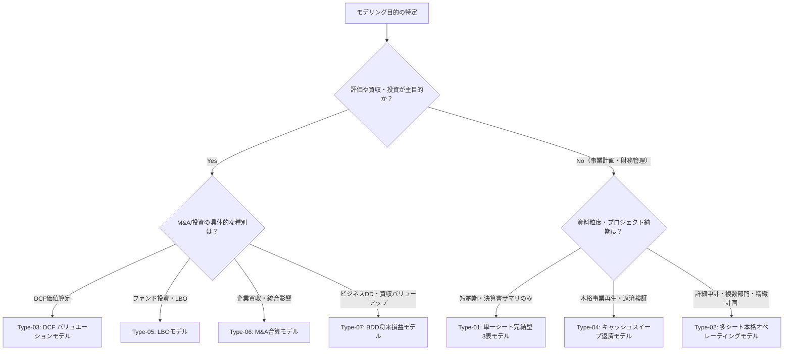

# 財務モデル型カタログ（model-archetypes.md）

本カタログは、プロジェクトの目的・期間・提供資料の粒度に応じて、最適な財務モデルの設計構造（型）を選択・適用するための体系的リファレンスである。
スライド作成における型カタログと同様に、**「案件の論点とゴールに合わせて型を選び、必要に応じて組み替えて適用する」**。

---

## 財務モデル型一覧（Overview）

| 型ID | 型名 | 主な用途・シーン | 推奨期間 | シート構成 | 主な出力指標 |
| :--- | :--- | :--- | :--- | :--- | :--- |
| **Type-01** | **単一シート完結型 3表連動モデル** | 初期検討、簡易シミュレーション、中小企業、短納期（1〜2日） | 実績1年＋予測3〜5年 | 1シート（`業績予想`） | 売上高、営業利益、当期利益、現預金残高、BS差額(0) |
| **Type-02** | **多シート本格オペレーティングモデル** | 中期経営計画策定、事業再生、詳細部門別予測、精緻な原価分析 | 実績2〜3年＋予測5年 | `Cover`, `inp`, `calc`, `debt`, `IS`, `BS`, `CF` | EBITDA、フリーCF、運転資本増減、ROIC、自己資本比率 |
| **Type-03** | **DCF バリュエーションモデル** | M&A企業価値評価、事業売却・買収検討、投資採算評価 | 実績2年＋予測5〜10年 | `Cover`, `inp`, `calc`, `IS`, `BS`, `CF`, `DCF` | 企業価値(EV)、株式価値、理論株価、WACC感応度テーブル |
| **Type-04** | **キャッシュスイープ返済モデル** | レバレッジド・ファイナンス、事業再生・私的整理、返済能力検証 | 実績1年＋予測5年 | `inp`, `IS`, `BS`, `CF`, `sweep` | DSCR（元利金返済カバー率）、年間繰上返済額、ネット有利子負債 |
| **Type-05** | **ペーパーLBO / 詳細LBOモデル** | PEファンド投資検討、バイアウト買収、MBO計画策定 | 投資時＋保有3〜5年＋Exit | `inp`, `LBO_Summary`, `Debt_Waterfall`, `Returns` | レバレッジ倍率、Exit時株式価値、IRR（内部収益率）、MoIC（投下資本倍率） |
| **Type-06** | **M&A合算・EPS希薄化モデル** | 経営統合、友好的TOB、株式交換/現金買収の財務影響分析 | 直近実績＋統合後3年 | `inp`, `CompanyA`, `CompanyB`, `PPA_Synergy`, `ProForma_IS_BS` | 合算売上/利益、のれん発生額、統合後EPS、増益/希薄化率(%) |
| **Type-07** | **BDD将来損益・バリューアップモデル** | ビジネスDD（BDD）、PEファンド買収検討、バリューアップ計画策定 | 直近実績1年＋予測5年 | 1シート（`業績予想`）または多シート | 正規化EBITDA、シナジー計画、プロフォルマ3表、Exit EV、MoIC、IRR |

---

## 各型の詳細仕様と設計パターン

---

### Type-01: 単一シート完結型 3表連動モデル（Single-Sheet 3-Statement Model）

```
[A列: エレベーターコラム]
├── （１）前提（売上成長率、原価率、SGA、税率、運転資本回転率、設備投資比率）
├── （２）損益計算書（売上高 → 営業利益 → 経常利益 → 当期純利益）
├── （３）有形固定資産（期首PP&E ＋ 設備投資 − 減価償却 ＝ 期末PP&E）
├── （４）利益剰余金（期首 ＋ 当期純利益 − 配当金 ＝ 期末）
├── （５）運転資本（売掛金 ＋ 棚卸資産 − 買掛金 ＝ 正味運転資本）
├── （６）借入金（期首借入 − 約定返済 ＝ 期末借入、支払利息計算）
├── （７）貸借対照表（資産合計 ＝ 負債・純資産合計、差額＝0チェック完備）
└── （８）キャッシュフロー計算書（営業CF ＋ 投資CF ＋ 財務CF ＝ 期末現金残高）
```

- **特徴**:
  - すべての計算が1つのワークシート内で完結。シート間の行き来がなく、視認性が極めて高い。
  - A列にセクション番号のみを配置し、`Ctrl + ↑ / ↓` で各表へ瞬時にジャンプできる「エレベーターコラム」構造を採用。
  - 貸借対照表の現金にCFの期末現金残高が直接戻ることで、3表が完全に循環・連動する。
- **使いどころ**:
  - クライアントから「とりあえず数年後の現預金ショートの有無を見たい」「売上が10%落ちたときに耐えられるか試算したい」と急ぎ相談されたとき。
  - 複雑な部門別データがなく、財務諸表サマリ（決算書原本）からクイックに組むとき。

---

### Type-02: 多シート本格オペレーティングモデル（Multi-Sheet Corporate Operating Model）

- **シート構成**:
  1. `Cover`: 表紙、前提・シナリオサマリ、更新履歴、担当者。
  2. `inp`: マクロ前提（インフレ率、為替、税率）、市場成長率、過去2〜3期の実績BS/PLデータ。
  3. `calc`: 
     - **運転資本スケジュール**: 売上高比率または回転日数（DSO / DIO / DPO）による受取手形・売掛金、棚卸資産、支払手形・買掛金の精緻予測。
     - **固定資産・減価償却スケジュール**: 既存資産の残存償却＋新規設備投資ごとの定額法/定率法償却スケジュール。
  4. `debt`: 
     - 既存借入金の返済予定表、新規調達枠、コミットメントライン、加重平均借入金利、利息計算（循環参照防止設計）。
  5. `IS`: 損益計算書（売上総利益、EBITDA、EBIT、EBT、当期純利益）。
  6. `BS`: 貸借対照表（流動資産、固定資産、流動負債、固定負債、純資産、バランスチェック行）。
  7. `CF`: キャッシュフロー計算書（間接法: 営業CF、投資CF、財務CF、ネット資金増減）。
- **特徴**:
  - 実務で最も標準的に用いられる大企業・中堅企業向けの正統派モデル。
  - 計算ロジック（`calc`, `debt`）とアウトプット財務諸表（`IS`, `BS`, `CF`）が明確に分離されているため、監査や第三者レビューに極めて強い。

---

### Type-03: DCF バリュエーションモデル（DCF Valuation Model）

- **追加シート**: `DCF`（または `Valuation`）
- **主要計算フロー**:
  1. **アンレバード・フリーキャッシュフロー（FCFF）の導出**:
     ```
     EBIT（営業利益）
     × (1 - 実効税率)          [NOPAT: みなし税引後営業利益]
     ＋ 減価償却費(D&A)
     − 設備投資(Capex)
     − 運転資本増加額(ΔWC)
     ＝ フリーキャッシュフロー(FCF)
     ```
  2. **加重平均資本コスト（WACC）の算定**:
     - 株主資本コスト（CAPM: リスクフリーレート ＋ β × マーケットリスクプレミアム）
     - 負債コスト（税引後金利）
     - 目標資本構成比（D/E比率）による加重平均。
  3. **現在価値（PV）の計算**:
     - 各年度のFCF × ディスカウントファクター（**年央調整: `(1 + WACC)^(t - 0.5)`**）。
  4. **ターミナルバリュー（TV: 継続価値）の算定**:
     - **永久成長率法（Gordon Growth）**: `TV = FCF_{t+1} / (WACC - g)`
     - **Exitマルチプル法**: `TV = 最終年EBITDA × 想定EV/EBITDA倍率`
  5. **株式価値（Equity Value）の導出**:
     ```
     事業価値（PV of FCF + PV of TV）
     ＋ 非事業用資産・余剰現預金
     − 有利子負債（Net Debt）
     ＝ 株式価値（Equity Value）
     ÷ 発行済株式数 ＝ 1株当たり理論株価
     ```
  6. **感応度分析テーブル（Sensitivity Matrix）**:
     - 縦軸: WACC（例: 6.0% 〜 10.0%、0.5%刻み）
     - 横軸: 永久成長率（例: 0.0% 〜 1.5%、0.25%刻み）または Exitマルチプル（6.0x 〜 10.0x）
     - マトリクス内に算出される理論株価をマッピング。

---

### Type-04: キャッシュスイープ返済モデル（Cash Sweep & Debt Waterfall Model）

- **主要ロジック（キャッシュスイープ構造）**:
  - 企業が生み出した営業CFから、最低限必要な事業資金（ミニマムキャッシュ）、必須設備投資、税金、約定利息を支払った後の「余剰資金（Free Cash Flow Available for Debt Service: CFADS）」を算出。
  - 余剰資金の一定割合（例: 50%〜100%）を、既存の有利子負債（借入金）の**繰上返済（Sweep）**に自動配分する。
  - 返済順位（ウォーターフォール）: シニアローン（短期・長期）→ メザニンローン → 株主還元（配当）。
- **使いどころ**:
  - 金融機関への返済計画策定、私的整理・事業再生ADR、ターンアラウンド支援。

---

### Type-05: ペーパーLBO / 詳細LBOモデル（LBO Financing Model）

- **主要モジュール**:
  1. **Transaction Assumptions（買収前提）**:
     - 買収価格（Entry Multiple: EV/EBITDA）、負債調達比率（Debt/Equity）、クロージングフィー。
  2. **Sources & Uses（資金調達と使途）**:
     - 使途: 株式取得対価、既存債務リファイナンス、アドバイザリー手数料。
     - 調達: シニアローン、メザニン、スポンサー（ファンド）出資持分。
  3. **Debt Schedule & Deleveraging（負債返済とレバレッジ解消）**:
     - 予測期間中のCFによる借入金返済進捗、利息負担軽減の推移。
  4. **Exit & Returns（回収とリターン算定）**:
     - Exit年（3年後〜5年後）のEBITDA × Exitマルチプル ＝ Exit時EV。
     - Exit時Net Debtを差し引いた「Exit時株式価値（Equity Proceeds）」。
     - スポンサー投資額に対する **IRR（内部収益率）** および **MoIC（Multiple on Invested Capital: 投下資本倍率）** の感応度マトリクス。

---

### Type-06: M&A合算・EPS希薄化モデル（Merger & Acquisition Combo Model）

- **主要モジュール**:
  1. **買収対価と調達（Deal Structure）**:
     - 現金買収、株式交換、負債調達（LBO性）の構成比率。
  2. **PPA（Purchase Price Allocation: 取得原価の配分）**:
     - 買収価格と純資産簿価の差額から、無形固定資産（特許・顧客関連資産）の認識と「のれん（Goodwill）」の算出、のれん償却額（日本基準）の算定。
  3. **シナジー（Synergy）計画**:
     - コストシナジー（調達共通化、拠点統合）、売上シナジーの年度別発現額。
  4. **合算プロフォルマ損益計算書（Pro Forma IS）**:
     - Buyer売上 ＋ Target売上 ＋ シナジー。
     - 買収に伴う追加支払利息、のれん償却費の加算。
  5. **EPS Accretion / Dilution（増益/希薄化分析）**:
     - 統合後の新発行株式数を反映したプロフォルマEPSを算出し、スタンドアローンEPSと比較して「EPSが何％増加（Accretion）または希薄化（Dilution）するか」を判定。

---

### Type-07: BDD将来損益・バリューアップモデル（Business Due Diligence & Value Creation Model）

- **主要モジュール**:
  1. **シナリオ切替スイッチ（Scenario Controller）**:
     - `C3` セル等のキースイッチ（1=Base, 2=Upside, 3=Downside）に基づき、`CHOOSE` 関数により全表のドライバー・業績予測・投資リターンが動的・瞬時に切り替わる構造。
  2. **実績の正規化ブリッジ（EBITDA Normalization Bridge）**:
     - 会計上の報告業績（Reported EBITDA）から、対象会社の真の実力値を算出。
     - 役員報酬適正化、創業者私的・非業務経費除外、一過性損益（工場移転費、訴訟費用等）の足し戻しにより「正規化EBITDA（Normalized EBITDA）」を導出。
  3. **KPIドライバー予測（KPI-Driven Operational Forecast）**:
     - トップラインを単なる成長率（%）ではなく、業界特性に応じたKPIドライバー（顧客数、解約率Churn、単価ARPU、変動原価率等）に分解して将来予測。
  4. **シナジー計画（Synergy Ramp-up Schedule）**:
     - 売上クロスセル（買収先顧客基盤活用）、調達コスト削減（共同購買）等の施策ごとに、年次発現率（Ramp-up %）を織り込んだシナジー効果を定量化。
  5. **プロフォルマ3表連動（Pro-forma 3-Statement Linking）**:
     - スタンドアローン業績 ＋ シナジー ＝ プロフォルマPL（売上高、EBIT、EBITDA）。
     - スケジュール連動（PP&E、デット返済、運転資本OWC）を経て、プロフォルマBS（全期間貸借一致）および間接法CF（現金プラグ）を完全連動。
  6. **バリューアップ成果およびExitリターン試算（Value Creation & Returns）**:
     - 5年後プロフォルマEBITDA × 想定Exit倍率 ＝ Exit時想定企業価値（EV）。
     - Net Debt控除後の株式価値（Equity Proceeds）を算出し、スポンサー投下資本倍率（MoIC）および内部収益率（IRR）を自動算出。

---

## どの型を選ぶべきかの決定フロー（Decision Tree）


