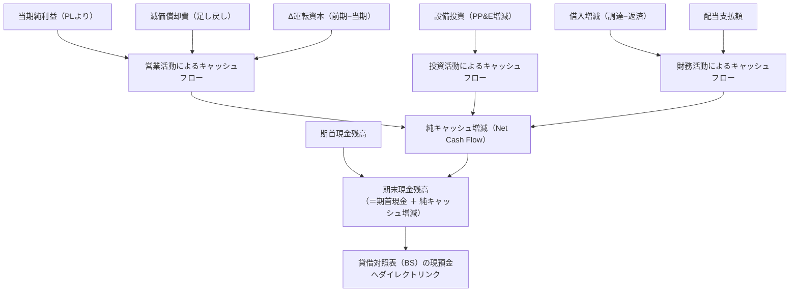

# 各種スケジュール連動計算ロジック（schedule-logic-guide.md）

財務モデリングで最もバグや不整合が多発するのは、財務諸表をつなぐ「スケジュール（Schedule）」の計算ロジックである。
本ガイドは、ロールフォワード（期首・期末の残高推移）、符号の反転規則、および循環参照を防止する標準計算ロジックを厳密に定義する。

---

## 1. 運転資本スケジュール（Working Capital Schedule）

運転資本（Operating Working Capital: OWC）は、事業運営に拘束される資金であり、キャッシュフロー計算書の「Δ運転資本」へ直結する。

### 1-1. 基本定義と対象科目
```
正味運転資本（OWC） ＝ 営業流動資産（売掛金 ＋ 棚卸資産） − 営業流動負債（買掛金）
```
- ※ 現預金（Cash）および有利子負債（短期借入金等）は運転資本に含めない（別途CF・デットスケジュールで計算するため）。

### 1-2. 予測アプローチ（2大方式）
- **方式A: 売上・原価比率方式（初心者・簡易モデル向け）**:
  - `売掛金 = 売上高 × 売掛金比率`（例: 実績の 売掛金 / 売上高）
  - `棚卸資産 = 売上原価 × 棚卸資産比率`（例: 実績の 棚卸資産 / 売上原価）
  - `買掛金 = 売上原価 × 買掛金比率`（例: 実績の 買掛金 / 売上原価）
- **方式B: 回転日数方式（プロフェッショナルモデル向け）**:
  - `売掛金 = (売上高 / 365) × DSO（売掛債権回転日数）`
  - `棚卸資産 = (売上原価 / 365) × DIO（棚卸資産回転日数）`
  - `買掛金 = (売上原価 / 365) × DPO（仕入債務回転日数）`
  - `CCC（キャッシュ・コンバージョン・サイクル） ＝ DSO ＋ DIO − DPO`

### 1-3. キャッシュフローへの符号連動（最重要）
キャッシュフロー計算書の間接法における「Δ運転資本」の符号は、初学者が最も間違えやすい落とし穴である。
```
キャッシュフローへの影響額（Δ運転資本） ＝ 前期運転資本 − 当期運転資本
```
- **資産の増加（売掛金増、在庫増）**: キャッシュの**流出（マイナス）**
- **負債の増加（買掛金増）**: キャッシュの**流入・手元留保（プラス）**
- **Excel数式例**:
  - C列（前期）、D列（当期）の場合:
  - `=C42 - D42`（運転資本が増加していれば自動的にマイナス値としてCFに反映される）。

---

## 2. 有形固定資産・減価償却スケジュール（PP&E Schedule）

有形固定資産は、設備投資（Capex）と減価償却費（Depreciation）を通じてPL・BS・CFの3表すべてに影響を与える。

### 2-1. ロールフォワード（Roll-Forward）の基本構造
```
期末有形固定資産 ＝ 期首有形固定資産 ＋ 設備投資（Capex） − 減価償却費 − 資産売却/除却
```

| 行項目 | 符号 | 参照元・計算式 | 3表への連動先 |
| :--- | :---: | :--- | :--- |
| **期首有形固定資産** | ＋ | 前期の期末有形固定資産（`=C30`） | - |
| **設備投資（Capex）** | ＋ | 前提（売上比率、固定額、投資計画） | **投資CF**（マイナスで連動） |
| **減価償却費** | − | 期首PP&E × 償却率、または個別資産償却 | **PL（販管費/原価）** ＆ **営業CF（足し戻し）** |
| **期末有形固定資産** | ＝ | `=SUM(期首:減価償却)` | **BS（固定資産）** |

### 2-2. 設備投資の予測アプローチ
- **維持更新投資型**: `設備投資 ＝ 減価償却費と同額`（事業規模維持の前提）。
- **売上比率型**: `設備投資 ＝ 売上高 × Capex比率（例: 3.0%）`。
- **計画積み上げ型**: 個別の大型投資計画（新工場建設 10億円 等）を特定年度に直接入力。

---

## 3. 借入金・利息スケジュール（Debt Schedule）

有利子負債の管理と支払利息の計算。循環参照を絶対に起こさない設計が求められる。

### 3-1. ロールフォワード構造
```
期末借入金残高 ＝ 期首借入金残高 − 約定返済額 ＋ 新規調達額
```

### 3-2. 支払利息の計算と循環参照回避ルール
Excelで財務モデルを組む際、支払利息を「期末残高」や「期中平均残高」で計算すると、以下の無限ループが発生する：

**【解決策（規約準拠）】**:
- **原則**: **「期首借入金残高（Beginning Balance）」ベースで計算**する。
  ```
  支払利息 ＝ 期首借入金残高 × 借入金利
  ```
  期首残高は前期末にすでに確定しているため、循環参照が構造的に100%発生しない。
- **発展（返済後残高）**: 期中に返済された後の「返済後残高」で計算する場合も、当期の営業利益や当期純利益に依存しない独立した約定返済スケジュールから計算する。

---

## 4. 利益剰余金・配当スケジュール（Equity Schedule）

損益計算書の最終利益（Net Income）を貸借対照表の純資産に統合するパイプライン。

### 4-1. ロールフォワード構造
```
期末利益剰余金 ＝ 期首利益剰余金 ＋ 当期純利益 − 配当金支払額
```
- **期首利益剰余金**: 前期の期末利益剰余金（`=C36`）。
- **当期純利益**: PLの最下行「税引後当期純利益（Net Income）」から直接リンク（`=D24`）。
- **配当金支払額**:
  - `配当金 ＝ 当期純利益 × 配当性向（例: 30.0%）`（マイナスで計上）。
  - ※当期純利益が赤字（マイナス）の場合はゼロ（無配）とするガードロジック:
    `=-MAX(0, 当期純利益 * 配当性向)`。
- **期末利益剰余金**: **BSの純資産の部「利益剰余金」**へ直接リンク。
- **配当金支払額**: **財務CFの「配当金支払」**へ直接リンク。

---

## 5. キャッシュフロー計算書（間接法）完全対照表

キャッシュフロー計算書（CF）は、PLとBSの差分から自動的に導出されるべきであり、決して手入力してはならない。



### 3大キャッシュフローの厳格な数式対照表

| キャッシュフロー区分 | 項目名 | 参照・計算ロジック | 符号の考え方 |
| :--- | :--- | :--- | :---: |
| **営業活動によるCF** | 税引後当期純利益 | `=PL!当期純利益` | 利益なら＋、損失なら− |
| | 減価償却費 | `=PP&E!減価償却費` | 非資金費用のため**必ず＋（足し戻し）** |
| | 運転資本増減額 | `=前期OWC - 当期OWC` | 運転資本増なら−、減なら＋ |
| | **営業CF小計** | `=SUM(税引後当期純利益:運転資本増減額)` | 通常はプラスが健全 |
| **投資活動によるCF** | 設備投資額 | `=-PP&E!設備投資額` | キャッシュ流出のため**必ず−** |
| | **投資CF小計** | `=設備投資額` | - |
| **財務活動によるCF** | 借入金返済額 | `=Debt!返済額` | 返済はキャッシュ流出のため**必ず−** |
| | 新規借入調達額 | `=Debt!新規調達額` | 調達はキャッシュ流入のため**必ず＋** |
| | 配当金支払額 | `=Equity!配当支払額` | 株主還元は流出のため**必ず−** |
| | **財務CF小計** | `=SUM(借入返済:配当金支払)` | - |
| **ネット増減** | **当期純資金増減額** | `=営業CF + 投資CF + 財務CF` | キャッシュの年間増減 |
| **期末残高** | **期末現金残高** | `=期首現金残高 + 当期純資金増減額` | **BS現金へ戻る** |
